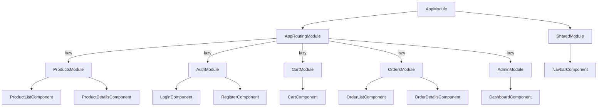

# Angular E-commerce App — Full Review

## Tech Stack

| Layer | Technology | Version |
|-------|-----------|---------|
| Framework | Angular | 21.2.0 |
| Styling | Bootstrap 5 + Bootstrap Icons + Custom CSS | 5.3.8 / 1.13.1 |
| Font | Outfit (Google Fonts) | — |
| API | DummyJSON (`dummyjson.com`) | — |
| Testing | Vitest + jsdom | 4.0.8 |
| Language | TypeScript | 5.9.2 |
| Build | `@angular/build` (Application builder) | 21.2.12 |

---

## Architecture Overview



All feature modules use **lazy loading** via `loadChildren` — this is well-structured.

### Routing Map

| Path | Module | Component |
|------|--------|-----------|
| `/products` | ProductsModule | ProductListComponent |
| `/products/:id` | ProductsModule | ProductDetailsComponent |
| `/auth/login` | AuthModule | LoginComponent |
| `/auth/register` | AuthModule | RegisterComponent |
| `/cart` | CartModule | CartComponent |
| `/orders` | OrdersModule | OrderListComponent |
| `/orders/:id` | OrdersModule | OrderDetailsComponent |
| `/admin` | AdminModule | DashboardComponent |
| `/` | — | redirects → `/products` |
| `**` | — | redirects → `/products` |

---

## What's FULLY Implemented ✅

### 1. Core Data Models
All 4 models are well-defined with proper TypeScript interfaces:
- [Product](file:///d:/ITI/Angular/E-commerce/src/app/core/models/product.model.ts) — `id`, `title`, `description`, `price`, `discountPercentage`, `rating`, `stock`, `brand`, `category`, `thumbnail`, `images`
- [User](file:///d:/ITI/Angular/E-commerce/src/app/core/models/user.model.ts) — `id`, `username`, `email`, `firstName`, `lastName`, `gender`, `image`, `token`
- [CartItem](file:///d:/ITI/Angular/E-commerce/src/app/core/models/cart.model.ts) — `product`, `quantity`
- [Order](file:///d:/ITI/Angular/E-commerce/src/app/core/models/order.model.ts) — `id`, `userId`, `items`, `totalAmount`, `status` (union type), `createdAt`, `shippingAddress`

### 2. Core Services (5 services, all complete)

| Service | API Source | Key Features |
|---------|-----------|--------------|
| [AuthService](file:///d:/ITI/Angular/E-commerce/src/app/core/services/auth.service.ts) | `dummyjson.com/auth` | Login via API, BehaviorSubject for state, localStorage persistence, token management, `isLoggedIn$` observable |
| [ProductService](file:///d:/ITI/Angular/E-commerce/src/app/core/services/product.service.ts) | `dummyjson.com/products` | Get all, get by ID, search, get categories, get by category |
| [CartService](file:///d:/ITI/Angular/E-commerce/src/app/core/services/cart.service.ts) | localStorage (client-side) | Add/remove/update items, `cartCount$` and `cartTotal$` derived observables, localStorage persistence |
| [OrderService](file:///d:/ITI/Angular/E-commerce/src/app/core/services/order.service.ts) | Local JSON mock | Loads from `orders.json`, create order (simulated), filter by user |
| [UserService](file:///d:/ITI/Angular/E-commerce/src/app/core/services/user.service.ts) | `dummyjson.com/users` | Get all users (paginated), get by ID |

### 3. Auth Interceptor
[AuthInterceptor](file:///d:/ITI/Angular/E-commerce/src/app/core/interceptors/auth.interceptor.ts) — Automatically attaches `Bearer` token to all outgoing HTTP requests.

### 4. Navbar Component
[NavbarComponent](file:///d:/ITI/Angular/E-commerce/src/app/shared/components/navbar/navbar.component.ts) — **Fully built** with:
- Dark glassmorphism design with `backdrop-filter: blur(20px)`
- Brand logo ("ShopNow") with gradient icon
- Navigation links: Products, Orders, Admin
- Cart icon with live badge counter (reactive via `cartCount$`)
- User dropdown (when logged in): avatar/initials, name, email, dashboard link, orders link, logout
- Login/Sign Up buttons (when logged out)
- Mobile-responsive (Bootstrap collapse toggler)
- Animated dropdown with `dropdownFadeIn` keyframes

### 5. Global Design System
[styles.css](file:///d:/ITI/Angular/E-commerce/src/styles.css) — Solid design tokens:
- CSS custom properties for colors, gradients, glass effects
- `--primary-gradient`: indigo → purple
- `--secondary-gradient`: blue → cyan
- Dark background with subtle radial gradient glow
- `.glass-panel` utility class (blur + border + hover effects)
- `.gradient-btn` / `.secondary-gradient-btn` with hover lift animations
- `.gradient-text` for gradient text effect
- `.animate-fade-in` entrance animation
- Outfit font imported from Google Fonts

### 6. Mock Data
[orders.json](file:///d:/ITI/Angular/E-commerce/public/assets/data/orders.json) — 4 realistic sample orders with DummyJSON product data, covering all 4 status types (Pending, Shipped, Delivered, Cancelled).

### 7. Bootstrap Integration
- Bootstrap CSS + JS bundle configured in [angular.json](file:///d:/ITI/Angular/E-commerce/angular.json#L60-L63)
- Bootstrap Icons font included

---

## What's PLACEHOLDER / Not Yet Built ⚠️

> [!WARNING]
> **6 out of 8 page components are empty scaffolds** — they only show the default `<p>_____ works!</p>` text. The services are ready, but nothing is wired to the UI.

| Component | Current State | What's Needed |
|-----------|--------------|---------------|
| [ProductListComponent](file:///d:/ITI/Angular/E-commerce/src/app/products/product-list/product-list.component.ts) | `<p>product-list works!</p>` | Product grid/cards, search, category filter, pagination, "Add to Cart" buttons |
| [ProductDetailsComponent](file:///d:/ITI/Angular/E-commerce/src/app/products/product-details/product-details.component.ts) | `<p>product-details works!</p>` | Product images gallery, description, price, rating, stock, add-to-cart, quantity selector |
| [LoginComponent](file:///d:/ITI/Angular/E-commerce/src/app/auth/login/login.component.ts) | `<p>login works!</p>` | Login form (username/password), validation, error handling, redirect after login |
| [RegisterComponent](file:///d:/ITI/Angular/E-commerce/src/app/auth/register/register.component.ts) | `<p>register works!</p>` | Registration form, validation, DummyJSON doesn't support real registration |
| [CartComponent](file:///d:/ITI/Angular/E-commerce/src/app/cart/cart/cart.component.ts) | `<p>cart works!</p>` | Cart items list, quantity controls, remove button, price totals, checkout button |
| [OrderListComponent](file:///d:/ITI/Angular/E-commerce/src/app/orders/order-list/order-list.component.ts) | `<p>order-list works!</p>` | Orders table/cards, status badges, date formatting, click to details |
| [OrderDetailsComponent](file:///d:/ITI/Angular/E-commerce/src/app/orders/order-details/order-details.component.ts) | `<p>order-details works!</p>` | Order summary, item list, shipping address, status timeline |
| [DashboardComponent](file:///d:/ITI/Angular/E-commerce/src/app/admin/dashboard/dashboard.component.ts) | `<p>dashboard works!</p>` | Admin stats, user list, order management |

---

## What's Missing Entirely ❌

- **Route guards** — No `AuthGuard` to protect `/orders`, `/admin`, or `/cart` checkout
- **Reactive Forms / Template-driven Forms** — `FormsModule` / `ReactiveFormsModule` not imported in any feature module
- **Loading states** — No spinners or skeleton screens
- **Error handling UI** — No error display components
- **Toast / notification system** — No user feedback on actions (add to cart, login success, etc.)
- **Pipes** — No custom pipes for currency formatting, date formatting, truncation, etc.
- **Footer component** — No footer
- **Search functionality in UI** — Service method exists but no search bar in product list
- **Pagination in UI** — Service supports `limit`/`skip` but no UI controls

---

## Summary

```
┌─────────────────────────────────────────────────────┐
│                  COMPLETION STATUS                    │
├─────────────────────────────────────────────────────┤
│ ████████░░░░░░░░░░░░  ~35% Complete                 │
│                                                      │
│ ✅ Architecture & routing     ✅ All 5 services       │
│ ✅ Data models                ✅ Auth interceptor      │
│ ✅ Navbar (fully styled)      ✅ Design system (CSS)   │
│ ✅ Mock data                  ✅ Bootstrap integration  │
│                                                      │
│ ⚠️ 6/8 page components are empty scaffolds           │
│ ❌ No route guards            ❌ No forms               │
│ ❌ No loading/error states    ❌ No notifications       │
└─────────────────────────────────────────────────────┘
```

**In short:** The backend layer (services, models, interceptor) and the structural foundation (modules, routing, design system, navbar) are solid. But the actual **page-level UI** is entirely unbuilt — every feature page just shows its default placeholder text.
